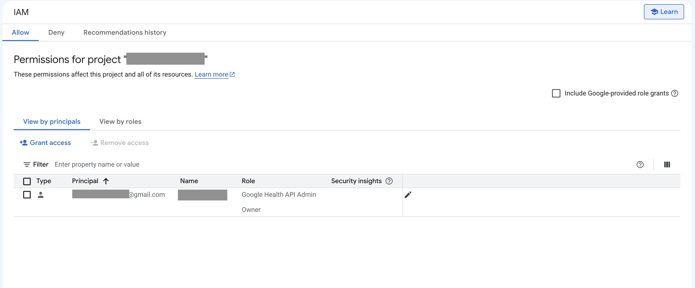
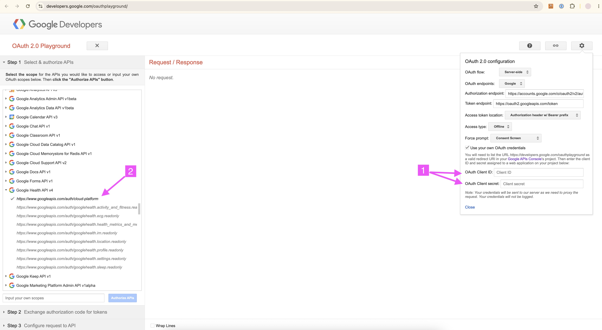

# Google setup

## Create the OAuth2 client

This document assumes you already have a Google cloud project.

Go to [Google Auth Platform / Clients](https://console.cloud.google.com/auth/clients).

Click "Create client".

For "Application type", choose "Web application".

In "Authorized redirect URIs", add:
* `https://your-website/google-oauth-webhook`

If you haven't done so already, copy the `.env.template` file from the project to a `.env` file.

Copy the Client ID and Client secret and put them into your `.env` file:
* `GOOGLE_CLIENT_ID`
* `GOOGLE_CLIENT_SECRET`

For `GOOGLE_WEBHOOK_AUTHORIZATION_TOKEN`, put a random string of your choosing. See the [subscriber EndPointAuthorization documentation](https://developers.google.com/health/reference/rest/v4/projects.subscribers#EndpointAuthorization) for more details.

In your `app-custom.yaml` file, specify the url for the oauth callback:
```yaml
google:
  callback_url: "https://your-website/"
```
Note: don't include the `/google-oauth-webhook` part. The application adds that path automatically.

## Configuring the Google webhook


### Setup IAM
Go the [Google Cloud console](https://console.cloud.google.com/).

Go to [IAM & Admin](https://console.cloud.google.com/iam-admin/iam).

Add the role "Google Health API Admin" to your Owner account.



### Setup the OAuth playground
Go to [OAuth clients](https://console.cloud.google.com/auth/clients) and select your client.

Add the following to the Authorized redirect URIs:
* https://developers.google.com/oauthplayground

Go to the [OAuth Playground](https://developers.google.com/oauthplayground).



1. Click the gear icon on the top right. Enter your OAuth Client ID and OAuth Client secret.
2. On the left, in the list of scopes, find Google Health API v4, and check the scope `https://www.googleapis.com/auth/cloud-platform`.

Click "Authorize APIs".

Click "Exchange authorization code for tokens".

### Create the subscription

Your server must be running. When you use this api to create the subscription, Google will call your server's webhook endpoint.

Select:
* HTTP Method: POST
* Request URI: `https://health.googleapis.com/v4/projects/<your google project number>/subscribers`
  - Be sure to use your Google Cloud's numeric "Project **number**" (not the string "Project ID").
* Request body:
```json
{
  "endpointUri": "https://your-website/google-notification-webhook/",
  "subscriberConfigs": [
    {
      "dataTypes": ["exercise", "distance", "sleep"],
      "subscriptionCreatePolicy": "AUTOMATIC"
    }
  ],
  "endpointAuthorization": {
    "secret": "Bearer <value of GOOGLE_WEBHOOK_AUTHORIZATION_TOKEN in .env>"
  }
}
```
  - Be sure to specify the correct values for:
    - `endpointUri`
    - `secret`

Click "Send the request".

Expected result:
* The response should be a success with http status 200.
* You should see the following in your slack-health-bot server logs:
```
2026-06-06 11:41:49,957 [root          ] INFO      [46c49dc0a8da49fb851a3f67b3fed81f] google_notification_webhook: type='verification'
2026-06-06 11:41:49,958 [uvicorn.access] INFO:     [46c49dc0a8da49fb851a3f67b3fed81f] 172.17.0.1:55026 - "POST /google-notification-webhook/ HTTP/1.0" 200
2026-06-06 11:41:49,990 [uvicorn.access] INFO:     [4dab3b30430343a08a12d4f585be091a] 172.17.0.1:55028 - "POST /google-notification-webhook/ HTTP/1.0" 401
```

#### Troubleshooting
If you have errors creating the subscription, check these instructions again, and make sure:
* Your IAM setup grants the "Google Health API Admin" to your owner account.
* You specify the correct numerical (not text) project number, in the url.
* You entered your Google Client ID and Client secret in the OAuth2 playground.
* You used the `auth/cloud-platform` scope when authenticating in the OAuth2 playground.